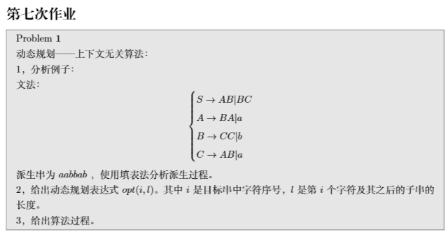

1.

| S、C |      |      |      |      |      |
| :--: | :--: | :--: | :--: | :--: | :--: |
|  A   |  B   |      |      |      |      |
|  Ø   |  Ø   | S、C |      |      |      |
|  B   |  Ø   |  A   | S、C |      |      |
|  B   | S、C |  Ø   | A、S | S、C |      |
| A、C | A、C |  B   |  B   | A、C |  B   |
|  a   |  a   |  b   |  b   |  a   |  b   |

2.

给出函数$source(s)$，其中$s$为一个集合或者一个字符，函数功能为求出s对应源头的集合。

$$  opt(i,l)= \begin{cases} source(a[i])& \text{l=1}\\ U_{j=1}^{l-1}source(opt(i,l-j)\times opt(l-j,j))& \text{l>1} \end{cases}$$

式中的$\times$为笛卡尔积。

3.

给出算法伪代码如下：

```
bool context_free(a[n]){//n为派生串的长度
		int dp[n][n+1]
		for len in 1...n:
			for i in 0..<n:
				compute dp[i][len];//按照状态转移方程计算出对应的值
		if(dp[0,n]==S) return true;
		return false;
}
```

